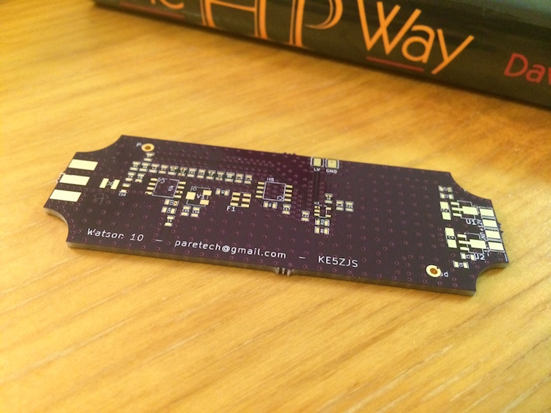
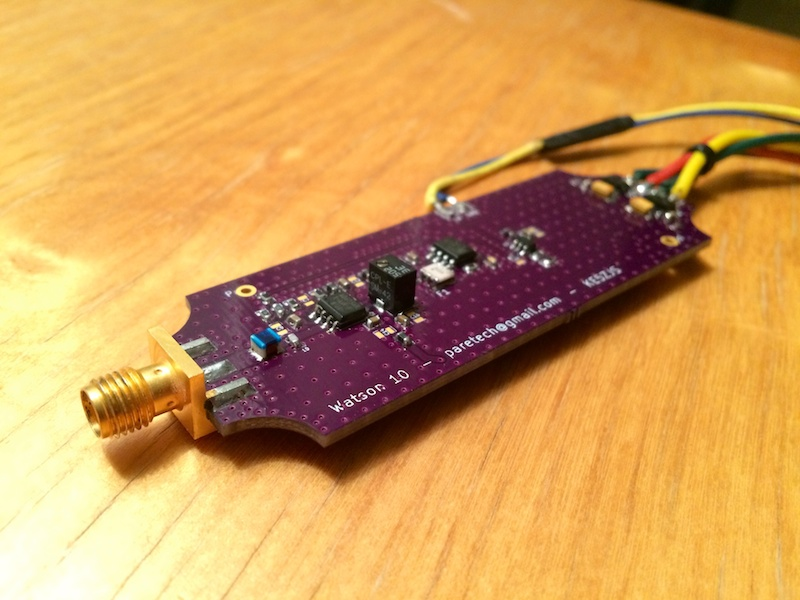
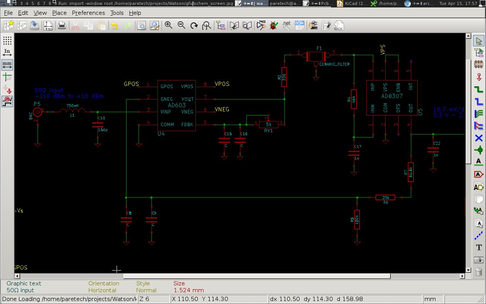
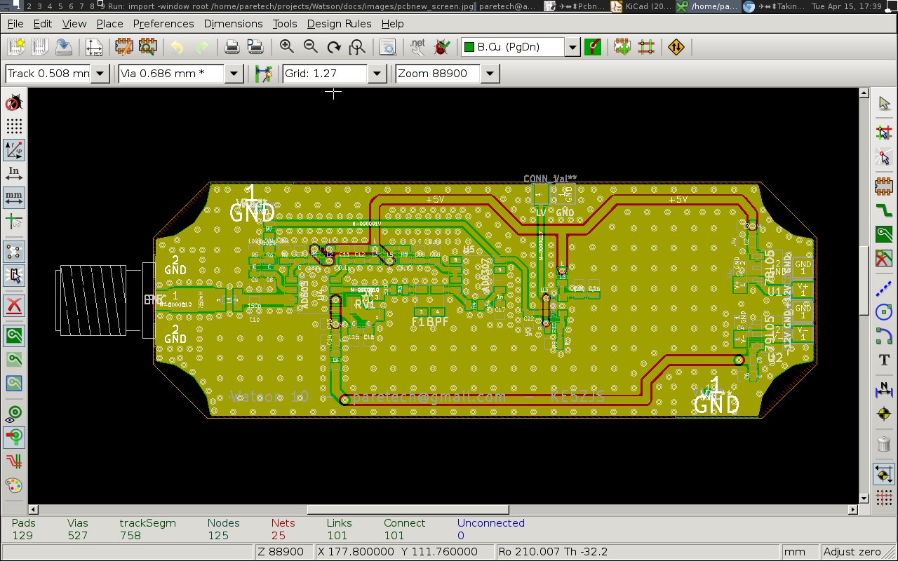
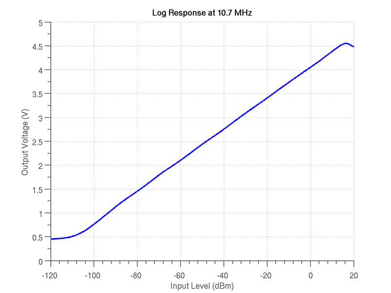
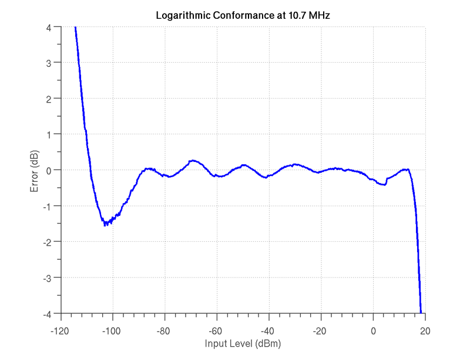

Watson
======

Watson is a relatively simple RF power meter based on the "120 dB Measurement System" outlined in the Analog Devices (AD) AD8307 data sheet. Watson has a narrow and fixed measurement band centered on 10.7 MHz and was developed as the detector for a low cost spectrum analyzer design. 

